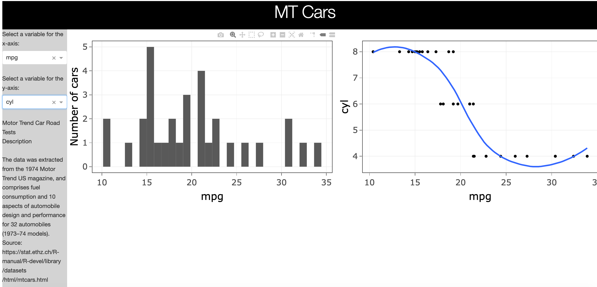
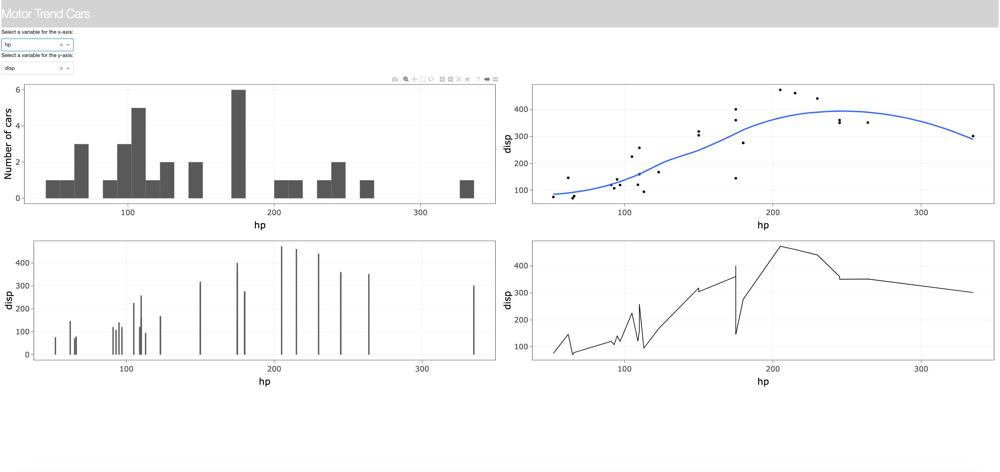
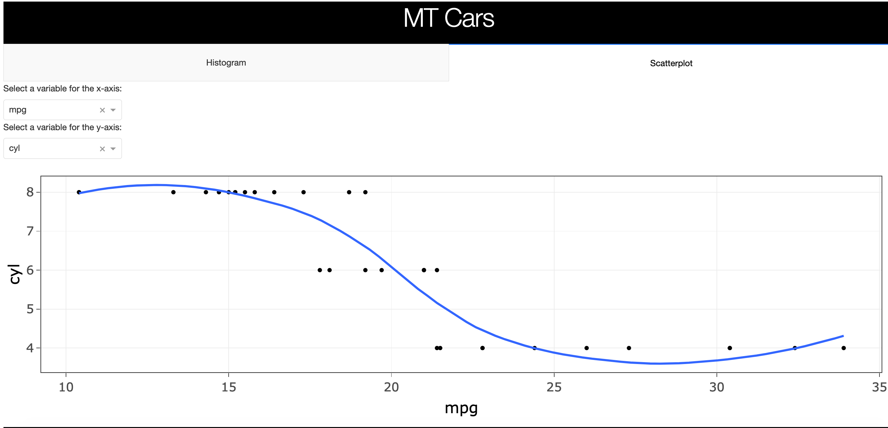

# dashr_sample_layouts

This repository is intended to give people new to DashR a hand in making layouts for their dashboards. We've found that the examples in most Dash tutorials to be too simple to be useful and the examples in the [Dash gallery](https://dash-gallery.plotly.host/Portal/) to be too complex for beginners. So, the teaching staff of STAT 547 at UBC has put together this small assortment of simple (but not too simple) layouts, with well commented code so you'll be able to see where customization is possible. 

The different layouts can be found in the descriptively titled folders. 

### The Layouts:

#### Two plots and a sidebar

> This layout simply has a header, and a sidebar with a description of the data as well as dropdown boxes that change the x- and y-axes of the plots in the main area of the page.

#### Four plots and a sidebar

> This layout has two dropdown boxes controlling the x- and y-axes of all four plots. In practice, this is not a useful thing to do, but it gives a good head start if you want to have a lot of graphs on your dashboard.

#### Basic tabs

> Tabs in DashR are a little more complicated than they look and more complicated and Dash for Python. They're good to use if you have a lot of plots or if you want to put documentation on a separate page. 

### Contribution

If you would like to contribute to this repo, simply fork the repo and open a pull request. If you see any errors, please open an issue.